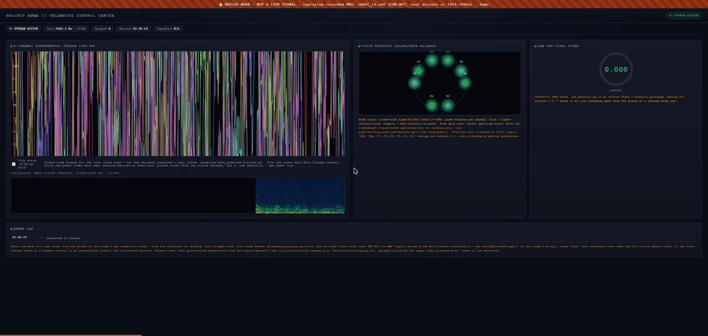

# Project Aura

An open-source, non-clinical research platform for capturing continuous,
ambulatory EEG data in a home environment, to help identify pre-ictal
(pre-seizure) signatures — and to make automated seizure detection
research reproducible enough to actually build on.

**Status:** software system built and verified end-to-end (broker,
storage, dashboard, ML validation pipeline, real Pico hardware) — no
Cyton acquisition board purchased yet, so live patient acquisition
isn't running. Everything below has been tested against either real
downloaded clinical EEG (CHB-MIT, PhysioNet) or real connected hardware,
not assumed from the design. See [`docs/DESIGN_DOCUMENT.md`](docs/DESIGN_DOCUMENT.md)
for the full spec this implements.

## See it running



This is the real system, not a mockup: `broker/` streaming an actual
CHB-MIT recording (`chb01_16.edf`, a real clinically-documented seizure
at 1015–1066s) through the same code path a live Cyton will eventually
use, into a real running dashboard. Every element in that GIF is backed
by something real:

- The orange **"REPLAY MODE — NOT A LIVE SIGNAL"** banner — because
  replaying recorded data and streaming a live patient must never be
  visually confusable, even in a demo.
- The **SEIZURE START / SEIZURE END** rows in the Event Log — real
  clinician-verified annotation timestamps from CHB-MIT's own summary
  file, not a live detection, and labeled as such.
- The **Scalp Topology** panel — real per-channel alpha/beta power,
  computed via direct DFT over the actual signal.
- The **Seizure-Likelihood Score** — a real, live `scikit-learn`
  `LogisticRegression`, trained on chb01's actual recordings, scored in
  the browser from features computed live off the real buffered signal
  — not a placeholder value. It's honestly caveated in the panel itself:
  fit on one subject, and known not to generalize well to others (see
  [Honest results](#honest-results-not-just-good-ones) below).

## Why this exists

Most home seizure-monitoring proposals stop at "we'll put electrodes on
someone and run ML on it." Aura's actual contribution is the plumbing
around that idea done properly:

- A **timestamped, tamper-evident event pipeline** (hash-chained CSVs,
  the same construction re-implemented and cross-verified in both Rust
  and Python) so a dataset collected on this system can be trusted.
- A **hardware-optional development path** — the entire broker →
  storage → dashboard → ML pipeline is exercised against real recorded
  EEG via a replay system, so software work isn't blocked on a £1,000
  acquisition board arriving.
- **Validation against public data before any patient data**, using the
  same scoring standard (SzCORE) and BIDS-adjacent export tooling the
  seizure-detection research community actually uses — not a bespoke
  metric invented for this project.
- **Honest reporting of what doesn't work yet**, including a real
  cross-subject generalization failure this project found and did not
  hide (see below) — because a grant reviewer (or a future contributor)
  needs the real picture, not the flattering one.

## Architecture

```
                    ┌─────────────────────────────────────────────┐
                    │              broker/ (Rust, tokio)           │
  Cyton (planned) ──┼─▶ cyton.rs ──┐                                │
                    │              │                                │
  chb01_16.edf ─────┼─▶ replay.rs ─┼─▶ broadcast::channel ──┬──▶ storage.rs (chained CSVs)
  (real CHB-MIT)     │              │                        │
                    │              │                        └──▶ dashboard.rs (WebSocket)
  Pico button ───────┼─▶ trigger.rs ┘                                      │
                    └─────────────────────────────────────────────┘       │
                                                                            ▼
                                                                  dashboard/index.html
                                                                  (vanilla JS, live in-browser)
```

1. **Acquisition** — an OpenBCI Cyton (8-channel) streaming EEG at
   250Hz, ingested via BrainFlow's Rust bindings (`broker/src/cyton.rs`
   — implemented, blocked only on the local BrainFlow C/C++ build once
   hardware exists).
2. **Replay** (`broker/src/replay.rs`) — streams a real recorded EEG
   file through the exact same event path `cyton.rs` will use, so the
   rest of the system is fully exercisable today. Optionally
   broadcasts real ground-truth seizure-interval annotations sourced
   from the dataset's own clinician-verified summary file.
3. **The Aura Trigger** (`hardware/pico_clicker/`) — a Raspberry Pi
   Pico physical button. Bypasses the need for a mobile UI during a
   neurological event by logging a timestamped, hash-chained event
   straight to the broker over USB serial. **Verified against real
   hardware** — see [`broker/README.md`](broker/README.md).
4. **Telemetry** (`broker/src/dashboard.rs`, `storage.rs`) — fans the
   event stream out to durable, tamper-evident local storage and a live
   WebSocket dashboard, so neither consumer's slowness affects
   ingestion.
5. **Pipeline** (`pipeline/`) — an MNE-Python pipeline: bandpass/notch
   filtering, Hjorth parameters, line length, and FFT band power,
   feeding a `LogisticRegression` classifier — validated against
   CHB-MIT (public data) before any patient data, using
   [SzCORE](https://github.com/esl-epfl/szcore)-aligned scoring.
6. **Dashboard** (`dashboard/index.html`) — a single self-contained
   vanilla HTML/JS file (no build step, no framework), running the
   *same* real feature computation as the Python pipeline, live, in the
   browser.

## Honest results, not just good ones

Everything here is against CHB-MIT (PhysioNet), a public pediatric
epilepsy EEG dataset — never patient data, per the design doc's own
gate. Full methodology and caveats: [`pipeline/validation/README.md`](pipeline/validation/README.md).

| Subject | Method | Sensitivity | False positives |
|---|---|---|---|
| chb01 | Single-feature baseline (line length) | 28.6% (2/7) | 4.5/hr |
| chb01 | Multi-feature LogisticRegression, leave-one-seizure-out CV | **7/7 (100%)** | 0.8–4.0/hr |
| chb01 | Same model, scored via [SzCORE](https://github.com/esl-epfl/szcore)'s real `timescoring` library | **7/7** | **2–9 events** (across all 7 folds) |
| chb02 | Identical methodology, different subject | 2/3 (66%) | 18.5–25.3/hr |

That last row is deliberate, not an oversight. A population classifier
that scores perfectly on the subject it was validated on and degrades
sharply on a different person is a real, common failure mode in this
field — and it's exactly the finding that motivates Aura's actual
design premise: a **personal**, per-patient pre-ictal signature rather
than a one-size-fits-all detector. A calibration extension
(`pipeline/aura_pipeline/calibration.py`) that fits a threshold from a
new patient's own baseline data (no seizure labels needed) is built and
tested with proper leave-one-subject-out methodology — currently weak
(33–43% sensitivity with only 2 training subjects) and honestly reported
as such while more subjects are validated.

## Example: running the replay pipeline

No Cyton hardware needed — this streams a real recorded seizure through
the actual broker:

```bash
# 1. Export a real CHB-MIT recording (with its real seizure annotations)
cd pipeline
.venv\Scripts\python.exe tools\export_replay_csv.py chb01 chb01_16.edf --start 940 --end 1150

# 2. Stream it through the real broker
cd ..\broker
set AURA_REPLAY_CSV=..\data\derivatives\replay\chb01_chb01_16_240640-294400.csv
set AURA_REPLAY_ANNOTATIONS_CSV=..\data\derivatives\replay\chb01_chb01_16_240640-294400_annotations.csv
set AURA_REPLAY_SPEED=2
cargo run

# 3. Open dashboard/index.html (served locally), set BROKER_WS_URL = "ws://127.0.0.1:9001"
```

## Example: validating a detector against public data

```bash
cd pipeline
.venv\Scripts\python.exe validation\validate_chbmit_multifeature.py chb01
.venv\Scripts\python.exe validation\validate_chbmit_szcore.py chb01   # cross-checked against SzCORE's real scorer
```

## Repository structure

```
project-aura/
├── docs/DESIGN_DOCUMENT.md   ← full spec — read this first
├── broker/                   ← Rust, async telemetry broker (runnable — see broker/README.md)
│   └── src/
│       ├── cyton.rs          ← live Cyton acquisition (blocked on local BrainFlow build)
│       ├── replay.rs         ← real recorded-EEG replay, incl. ground-truth annotations
│       ├── trigger.rs        ← Aura Trigger (Pico) serial ingestion — verified on real hardware
│       ├── storage.rs        ← chained, tamper-evident CSV storage
│       └── dashboard.rs      ← WebSocket server for the live dashboard
├── pipeline/                 ← Python, MNE-based preprocessing + features + CHB-MIT validation
│   ├── aura_pipeline/        ← filters, features, calibration, chain verification, SzCORE wrapper
│   ├── tools/                ← replay/BIDS/EDF export, dashboard model training
│   └── validation/           ← real, honestly-reported CHB-MIT results (see table above)
├── dashboard/                ← Vanilla HTML5 local visualization (see dashboard/README.md)
├── hardware/
│   ├── pico_clicker/         ← MicroPython firmware for the Aura Trigger — flashed and tested
│   └── enclosure/            ← TPU enclosure CAD (empty until hw arrives)
└── data/                     ← gitignored; raw/ and derivatives/ (BIDS-adjacent)
```

## Hardware safety constraints

- **Electrode degradation** — designed around heavy-duty conductive paste
  (e.g. Ten20) for a 4-to-6 hour high-fidelity nocturnal window; this has
  not yet been measured on real hardware.
- **Enclosure** — the Cyton must be housed in an impact-resistant TPU
  3D-printed case to prevent lacerations during convulsive events.
- **Wiring** — all electrode leads must be routed beneath a tight
  neoprene skullcap to eliminate strangulation risk.

## Non-clinical status

Aura is a research and discovery platform. It is **not** an
FDA/MHRA-approved medical device and must never be used for real-time
clinical decisions, automated medication dispensing, or emergency
dispatch. See `docs/DESIGN_DOCUMENT.md` section 5 for the full ethics
and limitations statement.

## Start here

- [`docs/DESIGN_DOCUMENT.md`](docs/DESIGN_DOCUMENT.md) — full spec:
  objectives, hardware architecture, data pipeline, safety/ethics,
  budget, roadmap, risks, and research citations.
- [`broker/README.md`](broker/README.md), [`pipeline/README.md`](pipeline/README.md),
  [`dashboard/README.md`](dashboard/README.md) — component-level status,
  what's verified vs. not, and how to run each piece.
- [`CLAUDE.md`](CLAUDE.md) — tech-stack boundaries and verification
  workflow for contributors.
